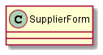
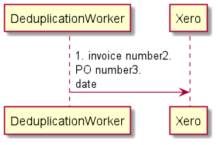
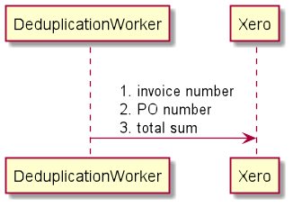
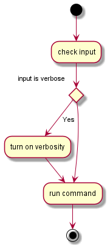
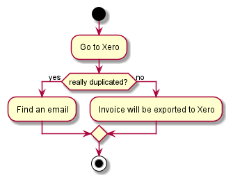
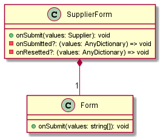
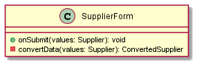

# PlantUML

## 0. Introduction

We use PlantUML instead of some free-drawing UI tool like Lycidchart,
Draw.io or Miro due to the following reasons:

* we can easily control versions and changes of the artefacts;
* we can reuse common entities across diagrams;
* it is easier to draw sequence diagrams as a code instead of 
drawing them in UI;
* and the most important, we make our diagrams closer to the code
preparing us to the following step when we transform one to another.

## 1. Common

### 1.1. Structure

1.1.1. We must store diagrams in the `docs` folder 
on the same level as a related entity.
The reason for the rule is to store all diagrams in one place
so diagrams do not mix with other files.

```
    // Bad
    components/
        supplier-page/
            index.ts
            supplier-page.class.puml
            supplier-page.presenter.tsx
            index.puml
            supplier-page.spec.tsx
            supplier-page.styles.ts
            supplier-page.view.tsx

    // Good
    components/
        supplier-page/
            docs/
                supplier-page.class.puml
                index.puml
            index.ts
            supplier-page.presenter.tsx
            supplier-page.spec.tsx
            supplier-page.styles.ts
            supplier-page.view.tsx
```

1.1.2. Each diagram must start from the declaration in the `index.puml`.
This declaration should contain only the public interface of the related entity.
The reason we do it is to be able to reuse this entity in other diagrams using imports.

1.1.3. Diagrams that describing test flow should be stored in the `test-cases` folder. 

### 1.2. Elements

1.2.1. Each diagram contains the title represented what the diagram really 
is or its reference to the business process.

// TODO: We should add that diagrams should not contain titles.
    TODO: Title is already part of the filename
    TODO: Search will work

// TODO: Add file about filename

```text
title UC. 06 Deduplication
```


1.2.2. Each diagram must define a name for a component using the `as` command.
It brings usability of refactoring the name of a component
without changing the name in all components where the diagram imported in.

```text
// Bad
@startuml

class SupplierForm {}

@enduml
```



```text
// Good
@startuml

class "SupplierForm" as SupplierForm {}

@enduml
```


### 1.3. Formatting

1.3.1. All the rules for formatting scripts should be used automatically for
formatting the same constructions in Plant UML. For example, the condition
operator on Activity Diagram. In this case, we should use rules for [formatting
the condition operator `if` in the code (2.5.1.c)](scripts.md#251-------).

1.3.2. Maximum line length is 60. Thus, we can see the code and the diagram.

1.3.3. Line breaks and new line

a. Line breaks go after the line content. 

b. A new line character is on the same line. It is between the content of the line
and a line break.

c. There is a space between all the parts of the line: the content, 
the new-line character and the line break.

d. If you need to use a line break, you should indent the following lines.

e. Each line that has a line break also has a new-line character. They always
go together. It makes formatting consistent both in the PlantUml code and on
the rendered diagram. If we do not `\n` for the first line, the default 
visualization tool draws the first line without the left indent.  

```text
// Bad
DeduplicationWorker -> Xero: \
1. invoice number\
2. \nPO number\
3. \ndate

// Bad
DeduplicationWorker -> Xero:\n1. invoice number\n 2.PO number
```




```text
// Good
DeduplicationWorker -> Xero: \n \
    1. invoice number \n \
    2. PO number \n \
    3. total sum
```



1.3.4. Opening and closing a diagram

a. There is an empty line after the opening tag and before the closing tag.

b. There is no indentation of the content between both tags.

The reason to have an empty line before opening and closing tags
is to split logical groups. It raises from our common script rules.

The reason to avoid an additional left indent and just add empty lines
is to have more space in the horizontal direction due to the limit
of the line, we specify in this standard.

```text
// Bad
@startuml
DeduplicationWorker -> Xero: /invoice/:id
@enduml

// Bad
@startuml
    DeduplicationWorker -> Xero: /invoice/:id
@enduml
```

```text
// Good
@startuml

DeduplicationWorker -> Xero: /invoice/:id

@enduml
```

### 1.4. Preview image

1.4.1. With the diagram, the image is also attached. Thus, it will 
be easier to preview them during the review.

Note: We can try to automate it generating images on pre-commit hook.

## 2. Activity diagram

### 2.1. Type

2.1.1. New version of the activity style is used. It looks more 
beautiful and readable.

// TODO: Add images for examples

```text
// Bad
@startuml

(*) --> "check input"
If "input is verbose" then
    --> [Yes] "turn on verbosity"
    --> "run command"
else
    --> "run command"
Endif
-->(*)

@enduml
```



```text
// Good
@startuml

start
    - Go to Xero

    if (really duplicated?) then (yes)
        - Find an email
    else (no)
        - Invoice will be exported to Xero
    endif
stop

@enduml
```



## 3. Class diagram

### 3.1. Common

3.1.1. The diagram contains not more than 8 components.

3.1.2. If the class diagram contains other classes
those classes should be imported using the `!include` directive.

```text
// Good
@startuml

!include 3.1.2-import-classes.index.puml
!include 3.1.2-import-classes.form.index.puml

class SupplierForm {
    - {method} onSubmitted?: (values: AnyDictionary) => void
    - {method} onResetted?: (values: AnyDictionary) => void
}

SupplierForm *-- "1" Form

@enduml
```



3.1.3. In the index file that should be imported into other diagrams, 
we should describe only public data.
So when we will reuse this diagram in the other diagram we will see only public data.
We do not need to know the private fields and methods.
If the private fields need to be added in the class diagram of a concrete entity 
we can do it with overriding.

```text
// Bad
@startuml

class "SupplierForm" as SupplierForm {
    + {method} onSubmit(values: Supplier): void
    - {method} convertData(values: Supplier): ConvertedSupplier
}

@enduml
```



```text
// Good

// index.puml
@startuml

class "SupplierForm" as SupplierForm {
    + {method} onSubmit(values: Supplier): void
}

@enduml

// supplier-form.class.puml
@startuml

!include index.puml

class SupplierForm {
    - {method} convertData(values: Supplier): ConvertedSupplier
}

@enduml
```


### 3.2. Method

3.2.1. A method signature should contain the method name, arguments with types
and return type.

// TODO: Add rule about avoiding using semi-colons

```text
// Bad
class SupplierPage {
    - {method} onSubmitted(value)
}
```

```text
// Good
class SupplierPage {
    - {method} onSubmitted(value: Supplier): Promise<void>
}
```

### 3.3. Class

3.3.1. Each class contains a letter and color which represents the 
type of the class:

| Letter | Value | Color |
| :--- | :--- | :--- |
| R | React Component | \#ff7700 |
| A | Abstract class | \#0984e3 |
| I | Interface | \#6c5ce7 |
| C | Component | \#e17055 |
| S | Service | \#fdcb6e |
| D | Dom element | \#fcba03 |

// TODO: <<interface>> | <<React component>>
// TODO: Try to use stereotype instead of this feature:
    - Stereotypes is more standards feature
    - It's more clear and represenative

## 4. Sequence diagram

### 4.1. Common

4.1.1. Each sequence diagram should have active lifelines. 
It could be done with the `activate <component>` command or using `++` in action flow.
Example `Component -> Database ++: save data`.

4.1.2. Using if/else statements are prohibited. 
We must split all possible cases into several diagrams instead.
Each diagram should cover a specific use case.

### 4.2. Messages

4.2.1. Message should contain a concrete API method or a concrete
return type.

// TODO: Add rule about shared elements

## 5. TODO

// TODO: Each project should contain styles declaration
// TODO: Add as a part of code style
// TODO: It's not just a painting of 5-year girl, it's a representation of
real code behaviour.
// TODO: Add rule about references to other diagrams
// TODO: Restrictions: use case, component, sequence, class and deployment