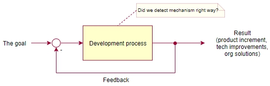
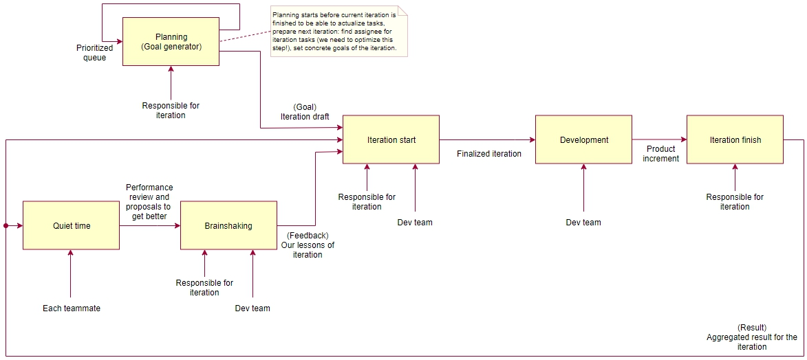

# Process

## 1. Система контроля версий

### 1.1. Правила именования

#### 1.1.1. Ветка

Необходимо придерживаться следующего формата именования веток:

`<тип задачи>/<номер задачи>-<краткое описание>`,

где

* тип задачи - новый функционал \(feature\), дефект \(bug\), предложение \(proposal\);
* номер задачи - номер задачи в системе учёта задач \(gitlab\), например 107. 

  Отсутствует для предложения \(proposal\);

* краткое описание - название задачи \(допустим более краткий вариант\) или краткое описание

  предложения \(proposal\) на английском языке \(не транслитом\) в kebab-case.

```text
// Плохо
issue-241-dictionary-infobar-route-stops
feature/241
bug/301

// Хорошо
feature/241-dictionary-infobar-route-stops
bug/301-broken-infobar-dropdown
proposal/new-branch-type-for-proposals
```

#### 1.1.2. \[Automated: commit-linter\] Сообщение к изменению

a. При фиксации изменения обязательно используется сообщение, описывающее изменение.

b. Сообщение должно описывать состав изменений и причину \(назначение\) изменения.

c. Сообщение должно иметь следующий формат:

```text
<номер задачи> <модуль 1>[/<подмолуль>][, ..., <модуль N>[/<подмодуль>]]: 
<состав и семантика изменения 1>[, ..., <состав и семантика изменения M>]
[; ...; <модуль K>[/<подмодуль>]: <состав и семантика изменения>]
```

Таким образом, самый простой вид сообщения:

```text
<номер задачи> <модуль>: <состав и семантика изменения>
```

Разновидность наиболее насыщенного изменения:

```text
<номер задачи> <модуль 1>/<подмолуль>, <модуль 2>/<подмодуль>: <состав и семантика изменения 1>, 
<состав и семантика изменения 2>]; <модуль 3>: <состав и семантика изменения>
```

где

* `<номер задачи>` - корректный путь до задачи, который в идеальном случае обеспечивает

  связь изменения в репозитории и задачи на уровне ссылки. Например, `#17`, `CD-11`, 

  `inni/issues#104`;

* `<модуль>` - название модуля, внутри которого вносится изменение. Модулем в данном случае

  называется любая директория в корне проекта, если эта директория вне директории `src` или

  любая директория внутри директории `src` \(или директории, считающейся корнем исходного

  кода приложения\). Если изменение касается проекта в общем, т.е. изменени структуры,

  изменение состава зависимостей, npm-скриптов и т.д., то в качестве модуля проставляется

  `common`. `common` также может относится к изменению в директории общего для модулей кода.

  Если изменение касается процесса непрерываной интеграции \(continuous integration\),

  то такое изменение отмечается: `ci`;

* `<подмодуль>` - название подмодуля внутри модуля. Подмодулем считается директория 

  внутри директории модуля;

* `<состав и семантика изменения>` - описание того, что и зачем было изменено.

Разделители:

* `<номер задачи>` отделяется пробелом  `` от остальной части сообщения;
* `<модуль>` и `<подмодуль>` разделяются слешем `/`;
* Группы `<модуль>/<подмодуль>` отделяются друг от друга запятой `,`;
* `<модуль>/<подмодуль>` и `<состав и семантика изменения>` разделяются двоеточием `:`;
* Группы `<модуль >: <состав и семантика изменения>` отделяются друг 

  от друга точкой с запятой `;`;

* Группы `<состав и семантика изменения>` отделяются друг от друга запятой `,`

В квадратных скобках `[]` указаны части сообщения, которые могут отсутствовать. Остальные составляющие являются обязательными.

Примеры:

```text
// Структура проекта
data-collectors <root of project>
    /dev
        /db
            /data
            /model
            /queries
    /src
        /common
            /services
                /data
        /instrument
        /report
    package.json

// Плохо

// Отсутствует суть изменений
#287 common: review fixes
// Нет номера задачи, в указании модуля присутствует название проекта 
// и указана излишняя вложенность
data-collectors/report/pasrer/historical: optimized parsing of the dom 
    to get 2x speed of parsing

// Хорошо
inni/issues#104 common: added script to update dependencies to cure integrity check error
inni/issues#105 instrument: changed source of data from source1 to source2 
    to get more stable data stream
inni/issues#106 dev/db: changed type of the field `value` of report to store data 
    from different sources;
report: implemented new service to get data from some new source of data.
inni/issues#107 common/services: added new service `report data service` to get 
    report data from database
```

d. Не должно быть вложенности больше `<модуль>/<подмолуль>`, т.е. максимальная точность указания изменения ограничивается вложенностью второго уровня. Если изменение касается двух подмодулей одного модуля, то оба варианта записи сообщения об изменении являются приемлемыми:

```text
// Вариант 1. Сообщение разбито по подмодулям
<номер задачи> <модуль 1>/<подмолуль 1>: <состав и семантика изменения>; 
<модуль 1>/<подмодуль 2>: <состав и семантика изменения>

// Вариант 2. Сообщение сгруппировано по модулю
<номер задачи> <модуль 1>: <состав и семантика изменения с указанием, 
что оно сделано в подмодуле 1>, <состав и семантика изменения с указанием, 
что оно сделано в подмодуле 2>;
```

e. Не должно быть точки в конце сообщения.

f. Сообщение должно быть на английском языке, не должно быть транслита.

g. Каждая часть изменения, т.е. `<состав и семантика изменения>`, начинается с глагола в прошедшем времени, т.е. описывает, что было сделано: `added ...`, `fixed ...`, ...

h. Исключение формата сообщения составляют автоматические фиксации изменений, выполняющиеся в процессе автоматизированной сборки и развёртывания, а также изменения в результате слияния веток.

i. Формат сообщения при фиксации изменения в процессе автоматизированной сборки:

```text
auto/ci: <текст сообщения>
```

Примеры:

```text
auto/ci: set version 0.1.24
```

j. Формат сообщения при слиянии веток:

```text
// Слияние ветки <название ветки> -> master
Merge branch '<название ветки>'

// Слияние ветки <название ветки 1> -> <название ветки 2>
Merge branch '<название ветки 1>' into <название ветки 2>
```

Примеры:

```text
Merge branch 'dev'
Merge branch 'feature/101-automate-rules-of-object-formatting' into dev
```

k. Вместо номера задачи в редких случаях, когда требуется внести очень мелкое изменение, под которое не имеет смысла создавать задачу \(исправление опечатки, корректировка какой-то случайной проблемы\), может указываться слово `microfix`.

```text
microfix common: added comment to skipped specs
```

## 2. Процесс внесения изменений

### 2.1. Внесение изменений

a. Предпочтительнее фиксировать небольшие и законченные изменения.

b. Вносимому изменению должна соответствовать задача, описывающая требуемые изменения.

c. Изменения по задаче должны выполняться в отдельной ветке, соответствующей задаче и названной в соответствии с правилами именования веток [п. 1.1.1](README.md#111-).

d. Основной \(рабочей\) веткой является ветка `dev`.

e. Релизной веткой, т.е. веткой, в которую подливаются изменения, когда они соответствуют следующей версии приложения, является ветка `master`.

f. Необходимо изменения сопровождать фиксацией сути изменения в файле `CHANGELOG.md` в корне проекта. [Ведите Changelog](https://keepachangelog.com/ru/1.0.0/)

g. Сообщения к изменениям должны соответствовать правилам оформления сообщений, указанным в [п. 1.1.2](README.md#112---).

h. Небольшие изменения \(исправление опечатки, корректировка какой-то случайной проблемы\), которые помечаются как `microfix`, могут вноситься сразу в рабочую ветку `dev`. Если изменение вызывает сомнение в стабильности, оно должно быть выполнено либо через задачу, либо через запрос на вливание этого изменения, чтобы оно прошло обзор кода \(ревью\).

i. Задача должна быть переведена в состояние «‎в работе», когда над ней действительно начата работа.

j. Допускается отправлять в репозиторий только «зелёные файлы», т.е. файлы, по которым пройдены все инспекции кода.

k. Перед отправкой изменений в репозиторий должны выполняться автоматизированный статический анализ кода и тесты. Не допускается отправлять изменения в репозиторий с отключенной проверкой кода и запуска тестов \(pre-commit / pre-push hooks\).

l. Добавленные изменения должны быть покрыты спецификациями \(автоматизированными тестами\).

### 2.2. Завершение работы над задачей

a. В файле `CHANGELOG.md` в корне проекта присутствует запись о сделанных изменениях. [Ведите Changelog](https://keepachangelog.com/ru/1.0.0/)

b. Задача должна быть перведена в состояние «ревью».

c. Должно быть выполнено саморевью задачи, т.е. просмотр своих изменений перед тем, как предложить сделать это другим участникам команды. На этом шаге, как правило, устраняются очевидные проблемы по стилю кода, лишним фрагментам кода, отладочной информации, недостающим комментариям и оптимизационным моментам по реализации.

d. Должен быть создан запрос на влитие изменений \(merge request / pull request\) в рабочую ветку `dev`. Аналогом может выступать создание ревью в инструментах типа Upsource на ветку с изменениями.

e. Должно быть выполенно ревью изменений участниками команды.

f. После того, как изменения приняты проверяющими, исполнитель должен подлить в свою ветку ветку `dev`, если есть конфликты, и затем выполнить влитие изменений в ветку `dev` с последующим удалением своей ветки.

g. Задача должна быть переведена в состояние следующее состояние задачи \(как правило, это состояние «‎готово»\) после её влития в `dev`.

### 2.3. Ведение журнала изменений \(changelog\)

a. В корне проекта должен быть файл `CHANGELOG.md`, в котором фиксируется суть вносимых изменений.

b. Правила ведения журнала изменений должны соответствовать, описанным на ресурсе: [Ведите Changelog](https://keepachangelog.com/ru/1.0.0/)

c. Для каждого изменения в начале строки должна быть указана ссылка на задачу, к которой относятся изменения.

```text
// Пример описанного изменения
- [`DXAPP-571`](https://smekalka.atlassian.net/browse/DXAPP-571) Added 
  [redux-logger](https://github.com/LogRocket/redux-logger) as redux middleware 
  to get alternative to react native debugger that slows down app during debug
```

d. Для записей в журнале изменений применяются те же правила по ограничению на длину строки, что и для других файлов.

e. Если запись многострочная, то все строки по отступу должны быть выровнены по начала первой.

f. Запись в логе изменений должна быть краткой, но ёмкой. Должно быть понятно, что и зачем было изменено.

g. Изменения, которые относятся к текущей версии, которая ещё не выпущена, должны быть в специальной секции `[Unreleased changes]` в начале файла. При релизе \(выпуске\) версии эти изменения помечаются конкретной версией релиза и датой его выпуска. Секция же `[Unreleased changes]` очищается и начинает принимать следующие изменения.

### 2.4. Обзор кода \(ревью\)

#### 2.4.1. Цели обзора кода

a. Распространение информации о новых изменениях в текущем и смежных проектах среди участников команды, чтобы все участники в равной степени понимали код проектов.

b. Повышение качества кода проектов.

с. Наращивание навыков разработки у участников команды.

d. Повышение мотивации писать код лучше.

e. Проверка корректности внесённых изменений в плане соответствия сути задачи.

#### 2.4.2. Смысл каждой цели в деталях

a. Если проектов больше 5 и объём кода в каждом из них растёт, участники команды, переходя на незнакомый проект или модуль, будут тратить время на вопросы к коллегам и попытки разобраться в чужом коде. Код ревью решает эту проблему: изменения будут просматриваться шаг за шагом маленькими порциями информации, которые легко усвоить. В результате каждый участник будет хотя бы понимать, что и как уже реализовано. \[?\] Также для решения этой проблемы необходимо использовать документацию.

b. Код пишется 1 раз, а читается много. Необходимо, чтобы код был очевидным и простым.

c. Более опытные участники команды, комментируя код, делятся опытом с менее опытными, тем самым повышая их уровень.

d. Когда автор осознаёт, что результат его работы будет кем-то проверяться, он стремится получить больше положительных комментариев и меньше запросов на исправление кода.

#### 2.4.3. Процесс обзора кода

a. Ревью инициируется созданием запроса на влитие кода и уведомлением об этом участников команды, которые должны просмотреть код.

b. При необходимости в процессе работы можно запрашивать ревью кода у других участников команды, чтобы на более ранней стадии решить возникающие вопросы и сомнения, реалзовав решение сразу более красиво и правильно.

c. В запросе на влитие должна содержаться информация о задаче, с которой связан этот запрос. Должна присутствовать ссылка на задачу.

d. Участники, проверяющие код, добавляют комментарии к запросу на влитие изменений.

e. Комментарии отмечает выполненными автор изменений, код которого просматривают.

f. После корректировки замечаний и реализации предложений должен запрашиваться повторный обзор кода.

g. Все вопросы по ревью обсуждаются наибыстрейшим из возможных способов. Недопустимо использовать такой способ коммуникации, при котором ответ затягивается, а соответственно затягивается и ревью.

#### 2.4.4. Process of task review not related with code management \(Github, Gitlab\)

We are talking about tasks like writing documentation in Notion, Confluence and so on.

Motivation: We want to decrease number of distracting requests to the author of changes to the single one in positive scenario. We want to distract each other less.

1. A reviewer puts wishes and remarks in comments of the thread of a message related to the task in `review` channel during the code review process.

   **Format**

   Message:

   > \[short task description\]  \[link to task\]

   Comments:

   > 1 \[Remark or wish 1\]  2: \[Remark or wish 2\]  N: \[Remark or wish N\]

2. After the reviewer has put all remarks and wishes, he notifies the author of task. Also he changes status of the task to «open» / «reopen». It is necessary so that other reviewers could make review only non-reviewed tasks.
3. The author of task checks out list of remarks and wishes, prepares a list of questions and discusses them with the reviewer. Before the author of task starts fixing he changes status of the task to «in progress».
4. The author of changes marks resolved item using smile: ✔
5. When the author of changes has finished and has marked all points as done, he notifies the reviewer too.
6. The reviewer marks items that are fixed correctly using smile ✔. If the reviewer does not agree with something, he requires fixes and improvements from the author of task. Repeat steps starting from the step 2 until all the items are «done».

#### 2.4.5. Противоречия и споры в процессе обзора кода

a. Споры и затягивание обзора кода не допускаются.

b. Как только появляются неоднозначности или разногласий в стиле кода, создаётся предложение по решению этого противоречия, которое отправляется на обсуждение другим участникам команды. Обсуждение и принятие предложения идёт отдельным потоком независимо от процесса обзора кода в соответствии с правилами по принятию новых предолжений.

c. Не допускается повторных обсуждений по поводу уже принятых правил в рамках ревью. Любые идеи и предложения выносятся отдельно. Обзор кода проходит в рамках уже принятых правил написания кода. Это не исключает возможности договориться о новых при хорошем уровне коммуникаций и взаимопонимания в команде. \(см. пункт выше\)

#### 2.4.6. Правила для участников, проверяющих код

a. Закрыв файл после проверки, вы тем самым полностью принимаете этот вариант так, как будто это написали вы. А так же вы уже несёте ответственность за уровень качества и работоспособности кода. Таким образом, после того, как вы увидели чей-то код - он стал уже вашим.

b. Если что-то правится быстро \(5-10 секунд\) и ошибка встречается впервые, проверяющий может поправить это самостоятельно. Это является предпочтительным вариантом. Если это имеет смысл, то можно уведомить автора об этих изменениях, чтобы он получил дополнительный опыт и учитывал его в дальнейшей работе.

#### 2.4.7. Состав участников обзора кода

a. Запрос на влитие изменений должен быть сделан на двух участников команды, которые в состоянии понять смысл изменений и подтвердить их корректностью. Не может считаться выполненным ревью, если проверяющий кристально чисто не может осознать суть внесенных изменений. В этом случае для ревью должны привлекаться другие участники команды, которые в силах это сделать. Не должны заливаться изменения, смысл которых неочевиден.

b. В случае отсутствия достаточного состава принимающих изменения участников команды запрос на влитие должен отправляться на руководителя группы, который должен обладать полным представлением о сути изменений.

c. \[?\] После завершения обзора кода обязательным составом проверяющих результаты обзора кода должны быть просмотрены оставшимися участниками команды, чтобы достичь обозначенных целей по обучению и погружению в проект. Ревью для всех, кто пишет код, вне зависимости от того, кому оно адресовано. Если Васе написали замечание или указали на ошибку, то все участники команды должны запомнить этот момент и не повторять его в будущем. Для этой цели может создаваться канал `#review` в мессенжере \(например, slack'е\), куда отсылаются все комментарии с ревью или ссылка на ревью.

Тут такие мысли:

1. Знакомство с добавляемым в проект функционалом преследует демо.
2. Какие-то изменения по стилю написания кода, которые могли бы увидеть другие участники

   команды, должны быть оформлены в виде предложений и добавлены в правила, т.е.

   по сути такую цель преследовать не стоит.

3. Участники команды могли бы увидеть какие-то интересные технические решения и подходы.

   Возможно, их также стоит вносить в общие правила как лучшие практики.

d. \[?\] В качестве варианта ревью, возможно, стоит рассмотреть вариант демонстрации кода автором с пояснениями. Это может сократить время, необходимое участникам команды на осмысление кода каждому в отдельности.

#### 2.4.8. Написание комментариев в процессе обзора кода

a. Критиковать код, а не автора. Помните, раз вы увидели этот код - то он уже тоже ваш.

b. Аргументировать принципами \(S.O.L.I.D., CLEAN и т.д.\), выдвигать предложения по улучшению, а не просто высказаться, что всё плохо.

c. Искренне высказывать позитивные эмоции, если что-то в коде понравилось. Это повышает мотивацию и продуктивность участников команды. Нужно помнить, что обзор кода направлен на повышение качества. Соответственно в процессе обзора кода важно отмечать и закреплять положительные моменты в коде, поощрять новые и интересные идеи.

d. Не писать в побудительном наклонении:

```text
    // Хорошо
    `Я бы исправил здесь A на Б`, `Давай исправим А на Б?`
    `Нам стоило бы в этом случае сделать так ...`

    // Плохо
    `Исправь А на Б`
```

#### 2.4.9. Отношение к комментариям в обзоре кода

a. Не оправдываться в комментариях: `А, да, точно, я затупил`, `Я невыспался` и т.д.

b. Не принимать на личный счёт. Все ошибаются. Не ошибается только тот, кто ничего не делает. Нам же просто нужно учиться на своём и чужом опыте, стараясь с каждым разом выполнять работу лучше и лучше.

c. Запомнить ситуацию, усвоить полученный опыт.

d. Если не согласны - обсудить. Не использовать агрессивно-защитные высказывания и пассивное игноирование. Держать в голове всегда цели обзора кода и команды в целом.

#### 2.4.10. Проверка стиля кода

a. У каждого участника должны быть настроены все автоматизированные средства для автоматической проверки и исправлений кода.

b. В результате необходимо стремиться к отсутствию комментариев, касающихся стиля кода.

#### 2.4.11. Приоритет обзора кода

a. Обзор кода не должен задерживать поток задач, соответственно должен быть приоритетным как для просматривающего изменения, так и для автора изменений. Задача в состоянии «‎ревью» имеет наивысший приоритет, если по какой-то причине явно не было принято другое решение в виде исключения.

b. Идеальное время влития изменений равно нулю, т.е. сразу после подачи запроса на влитие. Необходимо стремиться к этому времени. Недопустимо затягивать этот процесс. Участники команды должны стремиться максимально оперативно довести задачу до влития.

c. Запрос на влитие изменений не должен отправляться на участников команды, которые не могут своевременно выполнить обзор кода.

#### 2.4.12. Учёт при планировании

a. Время на ревью и исправления должно учитываться при планировании задач на итерацию.

b. \[?\] Должно учитываться время, которое необходимо всем участникам команды для просмотра результатов ревью.

### 2.5. Выпуск следующей версии приложения

Под выпуском \(релизом\) следующей версии приложения понимается срез текущего функционала рабочей версии приложения. При этом рабочая ветка `dev` заливается в релизную ветку `master`.

Порядок действий при релизе

1. dev -&gt; master
2. tag v.x.x.x
3. dev v.x.x.x + 1

Схема с веткой pre-release, если проект - это библиотека и проставление версии не может быть автоматическим. Хотя можно проставлять версию автоматически на основе changelog: added, changed, removed

## 3. Iteration

### 3.1. The main idea

a. The iteration of development process is an one iteration of the loop of setting sub-goals, product production, getting result and feedback to correct quality of the result including productivity as toughly coupled part of the result.



b. The iteration process is comprised of the following parts:

* Planning
* Iteration start
* Development
  * Task solving. It is not an event \(meeting\), it fills

    all available time.

  * Review
  * Dev team demo
* Iteration finish
* Quiet time
* Brainshaking



c. Total time for events: 9h

### 3.2. Roles

* Responsible for iteration, teammate with higher post in the team.

### 3.3. Planning

a. Duration: 3h

b. Goal: include the tasks with higher priority to the next iteration from business, tech and organizational task queues.

c. Tasks:

* actualize priority and set of tasks
* match assignees with tasks

d. Participants:

* responsible for iteration

e. Notes:

* we have to optimize this step \(too long and time consuming, 

  something wrong here\)

* all the tasks should be part of the concrete goals
* tasks should being actualized constantly and as a result we should

  have actual prioritized task queue all the time

### 3.4. Iteration start \(Setting microgoals\)

a. Duration: 15 min \(pre-event\) + 10 min

b. Goal: focus on iteration goals.

* actualize the next iteration according to results of previous one
* discuss goals, focus on the goals
* discuss tasks we have questions about

c. Participants:

* responsible for iteration
* dev team

d. Requirements to participants:

* responsible for iteration should prepare iteration draft
* teammates should check out iteration draft and write down

  their questions

### 3.5. Review

a. Duration \(every day\): 1h

b. Goal: feedback about task solutions.

d. Participants:

* dev team

e. Notes:

* you can find details [here](README.md#64---)

### 3.6. Dev team demo

a. Duration \(every day\): 15 min \(pre-event\) + 10 min

b. Goal: check progress of the goals.

c. Tasks:

* focus on given result rather than actions
* feedback
* get to know what other teammates do

d. Participants:

* responsible for iteration
* dev team

e. Requirements to participants:

* teammates should prepare summary of the results achieved during the day

f. Summary of the results:

* name and link to the task
* progress \(the percentage of completion\)
* accuracy of due date and time estimation
* achieve result \(there should not be description of activities\), 

  matching requirements and result

g. The meeting:

* Each teammate has only 2 minutes to demonstrate his results.

  You should NOT tell about, HOW you solve tasks, you should 

  talk about WHAT you have done and how far you have come on the way

  to goal.

* Questions to teammate.
* Repeat until there is at least one teammate has not demonstrated

  his work yet.

* Number of participants should be less or equal to 4.

### 3.7. Iteration finish \(summarize results\)

a. Duration: 30 min

b. Goal: summarize results.

c. Tasks:

* prepare statistics for done tasks per each teammate

  and aggregated result for the team

* get progress per goal
* actualize personal cards

d. Participants:

* responsible for iteration

e. Notes:

* we should automate it

### 3.8. Quiet time

a. Duration: 1h

b. Goal: teammate makes performance review by himself.

c. Tasks:

* check out results of iteration
* think about it
* summarize advantages and disadvantages
* prepare proposals to get better

d. Participants:

* dev team \(each teammate face to face to himself\)

### 3.9. Brainshaking \(Performance review\)

a. Duration: 15 min

b. Goal: performance review \(focus on goals\)

c. Tasks:

* discuss results of iteration
* estimate progress on the way to goals
* make conclusions, learn from this

d. Participants:

* responsible for iteration
* dev team

### 3.10. Отношение к оценке времени выполнения задачи

a. Если исполнитель задачи понимает, что задача не может быть выполнена за время, которым она была оценена, то нужно, как можно раньше донести эту информацию до руководителя группы. Если же о недостаточности времени становится известно либо в момент, когда лимит времени достигнут или превышен, то возможностей для маневра практически не остаётся.

b. Исходное \(оценочное\) время на задачу не изменяется, изменяется только время, которое осталось на доработку задачи.

### 3.11. Отношение к сроку выполнения задачи

TODO

### 3.12. Создание задач

TODO: Процедура добавления задач с меткой `unverified`.

Категоризировать задачи по важности \(признак, определяющий распределение задач при обзоре решения \(ревью\)\).

## 4. Внесение предложений

### 4.1. Порядок внесения предложений

a. Чтобы подать предложение, необходимо описать его в ветке с названием `proposal/<краткое название предложения>` и сделать запрос на вливание в ветку `dev`.

b. Запрос должен быть просмотрен заинтересованными в течение полного рабочего дня от начала подачи запроса. Также должна быть дана обратная связь: либо запрос должен быть подтвержден, либо выдвинуты предложения для его корректировки.

c. По истечении полного рабочего дня должно быть достигнуто конечное решение по предложению: принято \(исходное или скорректированное\) или отклонено.

d. Решение о принятии предложения принимается большинством участвующих голосов. Если количество голосов равно, то решение остаётся за руководителем группы.

e. Если кто-то не проявил интереса к предложению, т.е. не участвовал в его просмотре и обсуждении, это не должно мешать предложению быть принятым. Если никто не одобрил предложение в оговоренное время, оно считается принятым и должно быть влито в ветку `dev`.

f. Обсуждение предложения может идти в специальном канале в мессенджере или запросе на влитие. Если рассматривать вариант в отдельном канале чата, то должно быть отправлено сообщение с запросом на влитие, к которому уже в отдельном потоке оставляются комментарии.

### 4.2. Когда правила по стилю кода начинают работать?

a. Каждое новое предложение по стилю кода должно быть автоматизировано. Правило не работает, пока оно не автоматизировано.

b. Правило добавляется с пометкой `\[Не автоматизировано\]` в заголовке правила. Например: `3.2.2. \[Не автоматизировано\] Правила именования для обработчков`.

c. Должна быть создана задача на автоматизацию правила.

### 4.3. Localization of proposals

a. A proposal should be written down on both languages: Russian and English.

b. When you suggest your proposal, you can use only Russian language to avoid corrections in both versions. When the proposal is ready to merge, you should translate it to English.

## 5. Meetings

### 5.1. Meeting format

a. There should be agenda for the meeting. For example:

```text
Agenda:

1. Discuss problems of getting and manage requirements
during development process.
```

b. Meeting should not be greater than 30 min, i.e. it should be &lt;= 30 min.

c. There should not be optional participants. If a participant is optional, there should not be this participant on the meeting.

d. If a meeting is about discussion of some question, each participant should prepare some proposals for the meeting. If the participant does not have any proposals, he should be considered as someone who are not ready for the meeting. Access to the meeting should be restricted in this case. If there is a risk that someone can not understand that he should prepare some materials for the meeting, it does make sense to specify this explicitly.

```text
Agenda:

1. Discuss problems of getting and manage requirements
during development process. 

Requirements to participants:

1. Each participant should bring some proposals to solve
the problem of managing requirements.
```

e. Each participant has only 2 minutes to talk about his proposal. Nobody can interrupt him. After everybody can ask any questions to grasp the proposal. We have 3 minutes for this section.

f. When we get all proposals, we have 5 minutes to discuss them. We also have 5 minutes to get conclusions.

g. Each role on the meeting should be obvious:

* host of the meeting, manages meeting according to these rules;
* time checker, controls time frames of the meeting;
* scribe, summarize the results of meeting.

h. Number of participants should not be greater than 6, otherwise there is a risk to go beyond the meeting time, because if we have only 4 participants that fully consume their time, we have no time for other two participants.

i. Video/audio recording is required. Video is the preferable option.

j. Only demo can be greater than 30 min, it can be less or equal to 1h: 45 min - main part, 15 min - questions. The ideal way is to not step out time limit of 30 minutes.

### 5.2. Meeting parts

a. The host of the meeting checks that all participants are ready to the meeting. If someone are not ready, the host asks him to go out.

b. The host of the meeting recalls the agenda of meeting and hand it over to the one of participants.

c. The participant presents his opinion and proposals during his time limit. After other participants ask him.

d. When all participants have spoken out, they discuss all proposals to choose the best one.

e. Summarize results:

* approved decisions
* actions
* responsible persons
* due dates

For instance,

```text
Summary:

1. Describe format of a **wish** of stakeholder and
cirterias of transition from wish to a requirement.
Resp.: Anton K., 07.09.2019
2. Prepare requirements to module of buying avia tickets
according to approved format of wish and requirement.
Resp.: Danya S., 10.09.2019
```

f. If time frame of some part of the meeting is exceeded, time checker should make alarm about that. The host of the meeting recalls about the rule, interrupts current step and switch the meeting toward the next.

### 5.3. Number of meetings

We should try to use as minimum meetings as we can. If we can solve the issue without meeting, we should do that.

The main idea is to create and suggest proposals with higher quality that are the result of thoughtful though process rather than a spontaneous product during the meeting. Maybe some person spends more time, other spend less and can simply approve the proposals.

### 5.4. Meeting invitation

a. An invitation to a meeting should be sent at least 1 working day in advance. If the meeting requires pre-meeting step more than 2h, the host of the meeting should send invitation at least 2 working days in advance. There might be exceptions if the host of the meeting harmonizes all the things with other participants.

b. Each participant should send response for the invitation, so that the host of the meeting can see participants who really can be on the meeting.

c. If you get an invitation for a meeting, you must check you really need to participate. You should not be a victim of circumstances, you should not allow to steal your time. If you do not fully understand what purpose you should be on the meeting for, the meeting does not conform the required format, do not hesitate to ask to add more description to get all things clear. If you have grasped that you do not need to be on the meeting, you should decline it adding a reason to description.

### 5.5. Open questions

a. What cases do we really need meetings in?

b. Maybe the most right way to get highest quality and less time consuming is to solve all issues using proposals without meetings?

c. We should classify meetings. Each type of meeting should have its common requirements and prerequisites for the meeting and participants, so that we do not repeat ourselves each time we create the meeting.

