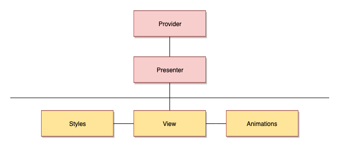

# Frontend

## 1. Компонент

В наших проектах мы следуем следующей архитектуре: 

### 1.1. Слой компонентной логики

Логика и обработка данных. Обычно поддерживается разработчиками.

#### 1.1.1. Provider

Основные вопросы: 1. С какими бизнес-данными работает компонент? 2. Какую бизнес-логику компонент реализует?

Ответственный за: 1. Получение и подготовку данных из store 2. Подготовка действий 3. Реализация бизнес-логики

Имя файла: `<component>.provider.tsx`

Экспортирует `mapStateToProps` и / или `mapDispatchToProps`.

Пример:

```text
export const mapStateToProps = (state: StoreState): MappingStateProps => ({
    ownCards: getOwnCards(state),
    cardsForList: getCardsForList(state)
});
```

#### 1.1.2. Presenter

Stateful компонент.

Основные вопросы: Что компонент делает?

Ответственный за: 1. Хранение и управление состоянием UI 2. Реализация всех методов \(любые обработчики, компонентная логика\)

Имя файла: `<component>.presenter.tsx`

Экспортируемое имя класса: `<Component>Presenter`

Пример:

```text
export class DomainListPresenter extends React.PureComponent<Props> {

    ...

    render(): React.ReactNode {
        const { ownCards, cardsForList } = this.props;

        return (
            <DomainListView
                items={ownCards}
                cardsForList={cardsForList}
                onCardUpdate={this.onCardUpdated}
                onCardAction={this.onCardAction}
            />
        );
    }

    private onDomainCreated(id: Guid): void {
        this.props.history.push(`${RouteType.DOMAINS}/${id}`);
    }

    private onCardUpdated(entity: CardEntity): void {
        const domainArgs = this.cardAppService.convertCardToDomainArgs(entity);
        this.domainActions.update(domainArgs);
    }

    ...
}
```

### 1.2. Презентационный слой

Только отображение UI.

#### 1.2.1. Styles

Основной вопрос: Как компонент выглядит?

Имя файла: `<component>.styles.tsx`

Пример:

```text
...

export const DomainListRoot = styled.div`
    position: relative;
    background: ${colors.background};
    height: 100%;
`;

export const CardListWrapper = styled(ContainerRoot)`
    height: ${styles.searchSectionPadding}%;
    overflow-y: auto;
`;

...
```

#### 1.2.2. View

Основной вопрос: Что компонент показывает?

Ответственный за: Вёрстку без состояния, обработчиков и т.д.

Filename: `<component>.view.tsx`

Экспортируемое имя класса / функционального компонента: `<Component>View`

Пример:

```text
interface Props {
    items: CardEntity[];
    cardsForList: CardEntity[];
    onCardUpdate: (entity: CardEntity) => void;
    onCardAction: (action: CardContextMenuAction, entity: CardEntity) => void;
}

function View({ items, cardsForList, onCardUpdate, onCardAction }: Props): React.ReactElement {
    return (
        <DomainListRoot>
            <CardListWrapper>
                <CardList
                    items={items}
                    onCardEdit={onCardUpdate}
                    onAction={onCardAction}
                />
            </CardListWrapper>
        </DomainListRoot>
    );
}

export const DomainListView = React.memo(View);
```

#### 1.2.3. Animation

Основной вопрос: Как компонент меняет свои состояния?

Ответственный за: Хранение состояний какой-либо анимации как для Framer Motion, так и для CSS

Имя файла: `<component>.animation.ts`

Пример:

```text
import { SwitchState } from '../switch.enum.ts';

const transition = { type: 'tween', duration: 1 };

export const animationStates = {
    container: {
        [SwitchState.OFF]: {
            background: '#bbbbbb',
            transition
        },
        [SwitchState.ON]: {
            background: '#0070df',
            transition
        }
    },
};
```

## 1.3. Index

Директория каждого компонента должна содержать файл `index` с экспортируемым `<Component>`. Если компонент содержит слой `Prodider`, то этот компонент должен подключать `mapStateToProps` и / или `mapDispatchToProps`. В остальных случаях просто переэкспортировать `<Component>`.

Пример с существующим `Provider` слоем:

```text
import { connect } from 'react-redux';
import { DomainListPresenter } from './domain-list.presenter';
import { mapStateToProps } from './domain-list.container';

export const DomainList = connect(mapStateToProps)(DomainListPresenter);
```

Пример с существующего `Provider` слоя:

```text
import { DomainListPresenter } from './domain-list.presenter';

export const DomainList = DomainListPresenter;
```

